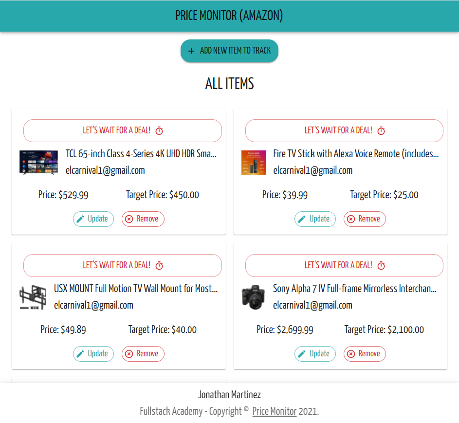

# Price Monitor App (Amazon)

### __Link__ : https://price-monitor-deals.herokuapp.com

## <u> Technology Stack: </u>
* Node.js
* Javascript / React.js
* Material UI
* Postgres SQL
* Puppeteer
* Nodemailer
* Node-cron
* Heroku

## <u> Description: </u>
This application will help users save money by monitoring prices of items in Amazon and notifying them via email when an item price has dropped below a provided target price. For intance, the app allow users to add as many items they want to monitor and add a target price to each item. Then the app will automatically check for price changes in Amazon every 4 hours or so. If the price of the item goes below the provided target price, the user will be notified via email informing the user that the items value has dropped and it is a good time to buy the item. 

The thought behind this app was to solve a problem that most customers face. For example, lots of stores might have a wish list and can send customers an email when they go on sale. But then customer have to open their email and see what the sale price is. If the price is not under what the customer is willing to pay, then the customer just wasted their time. Therefore, this app offer a solution by providing customers with the convenience and ease to bargain shop.

  

<!--  -->

## <u> Future Work: </u>
* Add Socket.io or websocket to improve user expericne with realtime updates.

* Add user authentication using JWT and/or OAuth. User will be able to see other users items, but user will only be able to update or delete their itmes.